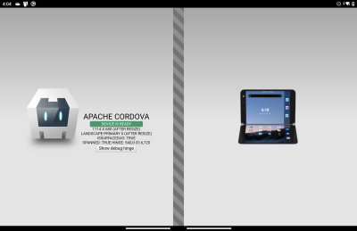
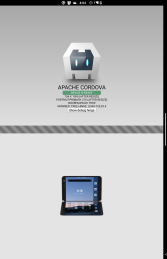
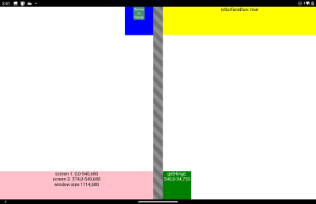
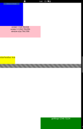

# cordova-samples

## [Surface Duo plugin demo](plugin-demo/)

Cordova sample that uses [this plugin](https://github.com/conceptdev/cordova-dualscreeninfo-plugin) to adjust the layout for the dual-screen Surface Duo.

 

## [Surface Duo plugin with CSS demo](plugin-css-demo)

Cordova sample that uses the [plugin](https://github.com/conceptdev/cordova-dualscreeninfo-plugin) and dual-screen CSS/JS polyfills to easily create layouts for the Surface Duo.

 

## Resources

- [Cordova dual-screen plugin repo](https://github.com/conceptdev/cordova-dualscreeninfo-plugin)
- [Surface Duo developer documentation](https://docs.microsoft.com/dual-screen/)
- [Surface Duo developer blog](https://devblogs.microsoft.com/surface-duo/)
