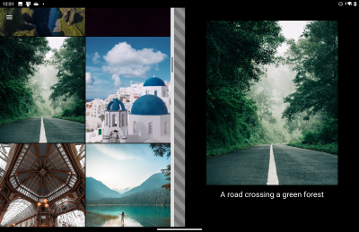
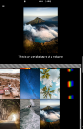

# Dual-screen Photo Gallery sample using CSS polyfill

Simple Cordova app demo that shows how use dual-screen CSS polyfill to simplify Surface Duo support using proposed web standards (which you can also use on your website).

 

The [foldable display polyfill repo](https://github.com/foldable-devices/spanning-css-polyfill) contains the JavaScript code, docs, and samples upon which this project is based.

## Basic setup

To create your own plugin demo app that minimally retrieves and displays device telemetry (including dual-screen info), refer to the [plugin demo project](../plugin-demo/).

## Photo Gallery sample

This app contains the [Photo Gallery code](https://github.com/foldable-devices/demos/tree/master/photo-gallery) from this [GitHub repo](https://github.com/foldable-devices). These steps were followed to package the sample as a dual-screen Cordova app:

1. Created a new Cordova app
1. Added the Android platform and the [dual-screen plugin](https://github.com/conceptdev/cordova-dualscreeninfo-plugin)
1. Contents of the source [**build** folder](https://github.com/foldable-devices/demos/tree/master/photo-gallery/build) copied into Cordova app's **www** folder.
1. Cordova scripts added to the **index.html** page.

    ```javascript
        <!-- Cordova scripts added to sample -->
        <script src="cordova.js"></script>
        <script src="js/index.js"></script>
    ```

1. In **js/index.js** add code to handle the `resize` event, and directly update the polyfill's state to adapt to the app being spanned (or un-spanned):

    ```javascript
    window.addEventListener('resize', onResize, true);
    function onDeviceReady() {
        // Cordova is now initialized. Have fun!
        console.log('Running cordova-' + cordova.platformId + '@' + cordova.version);
    
        updateSpanning();
    }
    /* every time the screen resizes we check the hinge dimensions to see if app has spanned/unspanned or rotated */
    function onResize() {
        updateSpanning();
    }
    function updateSpanning() {
        window.ScreenHelper.getHinge(
            function(result) { 
                var h = new Hinge (result);
                //alert('Spanned: ' + h.isSpanned + ' foldables ' + window["__foldables__"].screenSpanning);
    
                if (h.isSpanned) {
                    if (h.isVertical) {
                        window["__foldables__"].screenSpanning = 'single-fold-vertical';
                        window["__foldables__"].foldSize = parseInt(h.width);
                    } else { // isHorizontal
                        window["__foldables__"].screenSpanning = 'single-fold-horizontal';
                        window["__foldables__"].foldSize = parseInt(h.height);
                    }
                } else { // not spanned
                    window["__foldables__"].screenSpanning = 'none';
                    window["__foldables__"].foldSize = 0;
                }
            },
            function(error) {  document.getElementById('hinge').innerText = 'hinge: error ' + error; }
        );
    }
    ```

    (uses the `Hinge` class built for other samples in this repo)

Once deployed the web app works as normal, and the dual-screen parameters are injected on each `resize` event to make the polyfill behave as though the web view has dual-screen support.

## License

The [web application](https://github.com/foldable-devices/demos/tree/master/photo-gallery) that has been packaged for this sample (everything in the **/www/** directory) is licensed under [BSD-3-Clause](LICENSE).

## Resources

- [Foldable-devices polyfill repo](https://github.com/foldable-devices/)
- [Cordova dual-screen plugin repo](https://github.com/conceptdev/cordova-dualscreeninfo-plugin)
- [Surface Duo developer documentation](https://docs.microsoft.com/dual-screen/)
- [Surface Duo developer blog](https://devblogs.microsoft.com/surface-duo/)
