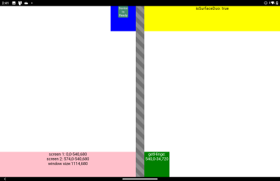

# Cordova Screen Helper plugin demo using dual-screen CSS polyfill

Simple Cordova app demo that shows how use dual-screen CSS polyfill to simplify Surface Duo support using proposed web standards (which you can also use on your website).

## Basic setup

To create your own plugin demo app that minimally retrieves and displays device telemetry (including dual-screen info), refer to the [plugin demo project](../plugin-demo/).

## Dual-screen CSS

The dual-screen CSS support is covered in the [documentation](https://docs.microsoft.com/dual-screen/web/css-media-spanning).

The polyfills for CSS and JavaScript support are from the [foldable-devices repo](https://github.com/foldable-devices/).

The dual-screen CSS samples are from [this web-sample](https://github.com/conceptdev/web-samples/tree/master/dual-screen-css).

### Simple

This simple example uses two `div` elements and the CSS `@media` support to show or hide and position the second `div` when the app is spanned across two screens:

 

```html
<div class="text">Main Content</div>
<div class="fold angled stripes"></div>
<div class="second-container">Detail panel</div>
```

```css
@media (spanning: single-fold-vertical) {
    .main-container {
      width: env(fold-left);
      height: 100vh;
    }
    .fold {
      height: env(fold-height);
      width: env(fold-width);
    }
    .content {
      flex-direction: row;
    }
    .second-container {
      height: 100vh;
      width: calc(100vw - env(fold-left) - env(fold-width));
    }
}
```

### Boxes

The boxes page positions a number of `div` elements using different CSS rules:

 

View the [**boxes.html** source](www/boxes.html) to see the CSS and HTML.

## Cordova security warning

THe dual-screen polyfill JavaScript code uses `fetch` to load and inspect CSS files - there is a [known issue](https://github.com/apache/cordova-android/issues/1004) with using `fetch` with `file://`-served web content. For this sample to work, the CSS files have been included in the HTML.

## Resources

- [Cordova dual-screen plugin repo](https://github.com/conceptdev/cordova-dualscreeninfo-plugin)
- [Surface Duo developer documentation](https://docs.microsoft.com/dual-screen/)
- [Surface Duo developer blog](https://devblogs.microsoft.com/surface-duo/)
